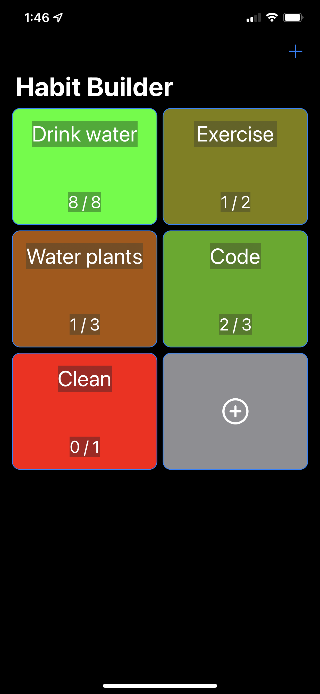
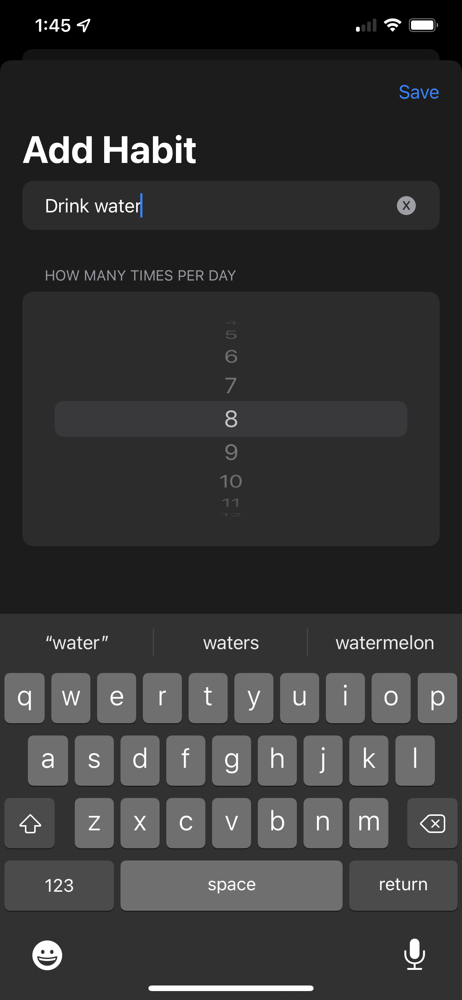
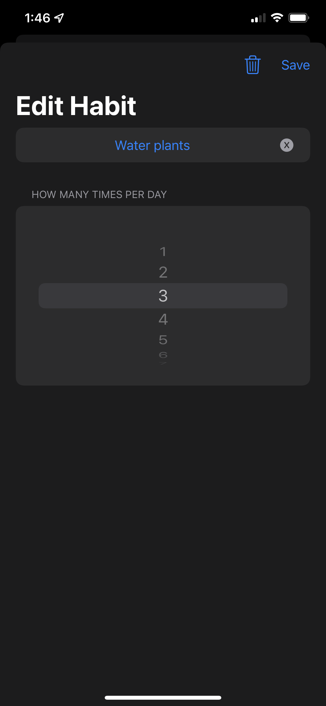

# HabitBuilder
App for building better habits. Day 47 Challenge project of 100 Days of SwiftUI. 

Habit builder is an app from scratch aimed at helping people build better habits. The initial brief was to just make a list of habits that you could edit and tick off as the day went on. I was having fun and continue to refine the project. 

  

If you are coming here for ideas on the day 47 challenge project, feel free to look around the code and implement what entertains you, just remember to keep on learning!

## TODO

1. Clean up the interface, its very basic and ugly atm.
2. Create some pleasing animations for when things get toggled
3. add haptic function to the short and long presses to give some more feedback to the user
4. Improve the colors
5. Add in a reset time for the list, let the user define it
6. Add a notification system to remind the user to do the things on their list.
